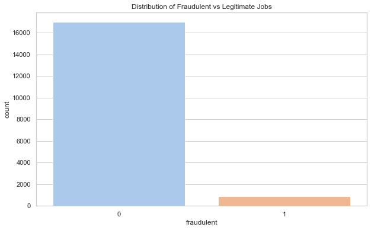
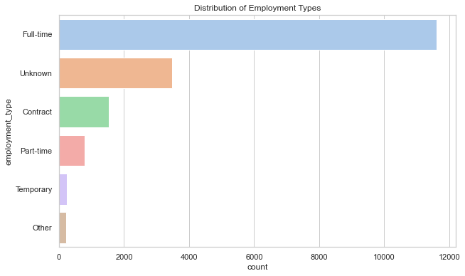
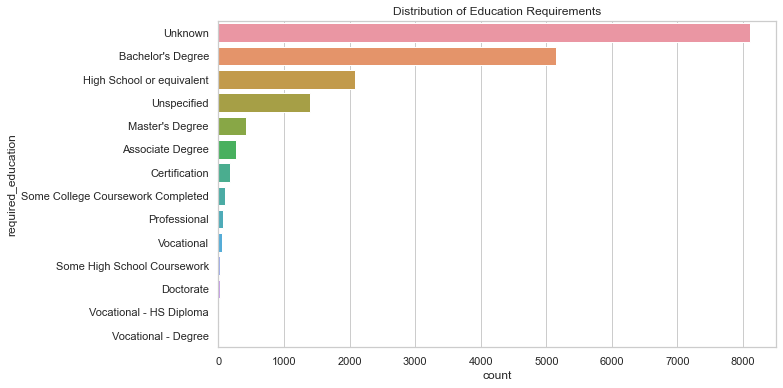
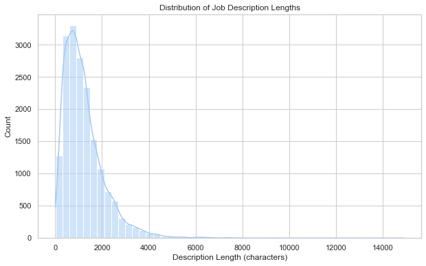
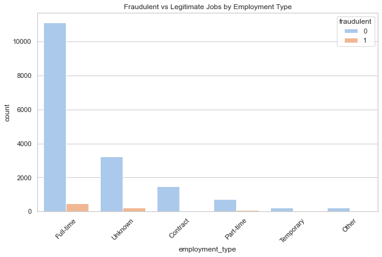
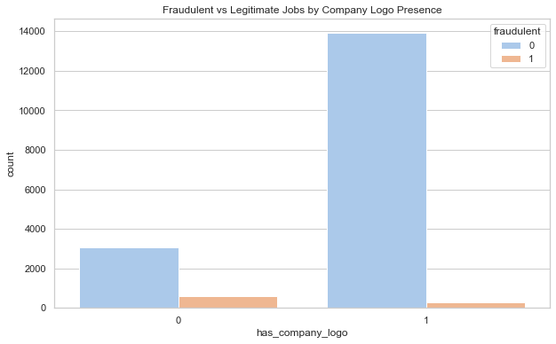

#  PROJECT TITTLE: 🕵️‍♀️ SPOTTING FAKE JOBS

# 📝 PROJECT OVERVIEW

Although fraudulent job postings account for only a small fraction of online listings, their consequences for job seekers are disproportionately severe, ranging from financial loss to identity theft. The class imbalance in this dataset mirrors real-world challenges such as fraud detection and medical diagnosis, where rare events carry critical importance. This project aims to develop and evaluate machine learning models capable of detecting these fraudulent postings, applying advanced techniques such as SMOTE and class weighting to address the imbalance. By prioritizing recall and F1-score over simple accuracy, the project ensures reliable detection of fraudulent postings, ultimately enhancing safety and trust in online recruitment platforms.

While the majority of online job postings are legitimate, fraudulent postings, though rare, pose a significant risk to job seekers. Victims of fake job ads can face financial loss, identity theft, and wasted time, leading to a decline in trust in online recruitment platforms. Because fake postings make up only a small fraction of the total, the challenge lies in building a machine learning model that can effectively detect these rare but harmful cases.

# ⚠️ PROBLEM STATEMENT

While the majority of online job postings are legitimate, fraudulent postings, though rare, pose a significant risk to job seekers. Victims of fake job ads can face financial loss, identity theft, and wasted time, leading to a decline in trust in online recruitment platforms. Because fake postings make up only a small fraction of the total, the challenge lies in building a machine learning model that can effectively detect these rare but harmful cases.

# 🎯 OBJECTIVES

1. To identify potential indicators of fradulent jobs.

2. To identify a job as fradulent or legitimate.

3. To generate actionable insights for job seekers and platforms to detect and prevent fradulent posting.

# 💼 BUSINESS UNDERSTANDING

Problem for Stakeholders: Online recruitment platforms risk losing credibility and user trust due to fraudulent job postings.

Goal: Develop an intelligent detection system that flags suspicious job postings before they reach job seekers.

Value:

Protects job seekers from scams.

Enhances platform trustworthiness.

Saves time and resources in manual verification.

Key Business Question: Can fraudulent job postings be predicted using features like job descriptions, company profile, and employment type?

# 🗂️ DATA UNDERSTANDING

The dataset contains job postings with both structured (categorical, numerical) and unstructured (text) features.

Key Columns:

fraudulent (Target variable): 0 = legitimate, 1 = fraudulent.

company_profile, description, requirements, benefits (Text features): Contain detailed job posting content.

employment_type, required_experience, required_education, industry, function, location (Categorical features).

salary_range (Dropped due to sparsity, but could be engineered if imputed).

Observations:

Imbalance in target variable: Legitimate jobs far outweigh fraudulent ones.

Missing values in categorical and text columns (handled by imputation with "Unknown" and "Not Provided").

Data type variety: Mixture of categorical, textual, and binary fields requires tailored preprocessing.

# 🔍 ANALYSIS

⚖️ Fraudulent vs Legitimate Jobs: Legitimate jobs dominate (~16,000) while fraudulent ones are rare (~2,000), highlighting class imbalance.

📌 Employment Type Distribution: Full-time dominates, followed by unknowns, with contract, part-time, and temporary roles being far less common.

🎓 Education Requirements: “Unknown” is the largest category, followed by Bachelor’s Degree. Other levels (Master’s, High School, Associate, etc.) appear less frequently.

📝 Job Description Lengths: Most descriptions fall within 0–2000 characters, showing postings are generally concise.

💼 Employment Type & Fraud: Full-time roles are the most common and mostly legitimate. Fraudulent jobs appear in much smaller numbers across all types.

🏢 Company Logo Presence: Jobs with a logo are overwhelmingly legitimate, suggesting logo presence is a strong trust indicator.

# 🤖 MODELLING 

# 🧪 EVALUATION

# 📢 FINDINGS 

# 🚀 RECCOMANDATIONS
