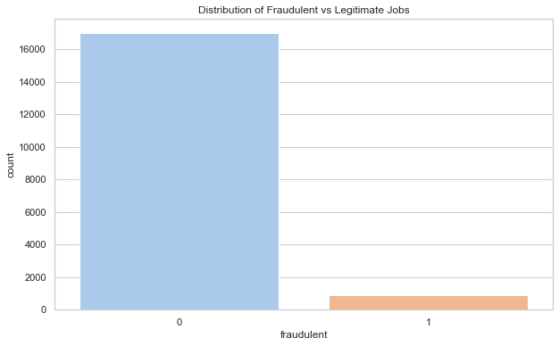
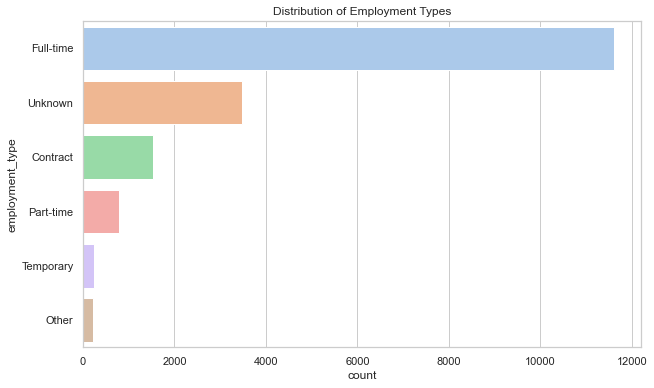
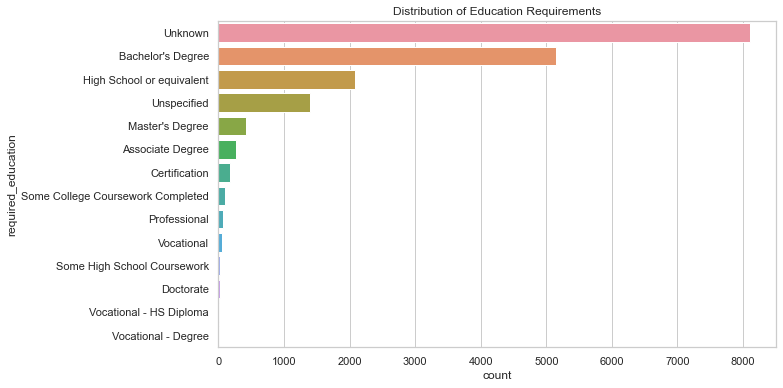
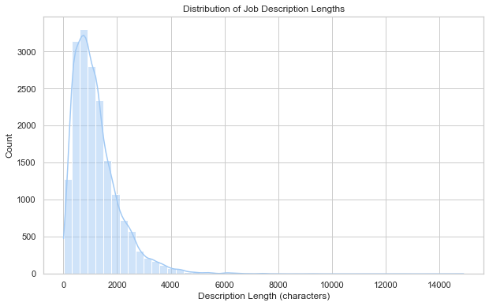
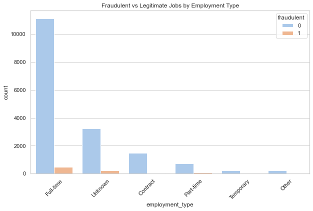
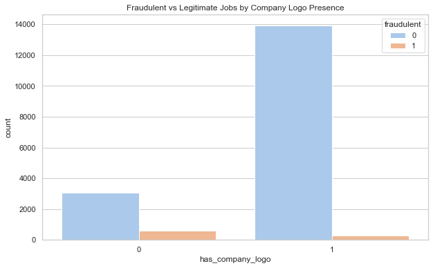

#  PROJECT TITTLE: 🕵️‍♀️ SPOTTING FAKE JOBS

# 📝 PROJECT OVERVIEW

Although fraudulent job postings account for only a small fraction of online listings, their consequences for job seekers are disproportionately severe, ranging from financial loss to identity theft. The class imbalance in this dataset mirrors real-world challenges such as fraud detection and medical diagnosis, where rare events carry critical importance. This project aims to develop and evaluate machine learning models capable of detecting these fraudulent postings, applying advanced techniques such as SMOTE and class weighting to address the imbalance. By prioritizing recall and F1-score over simple accuracy, the project ensures reliable detection of fraudulent postings, ultimately enhancing safety and trust in online recruitment platforms.

While the majority of online job postings are legitimate, fraudulent postings, though rare, pose a significant risk to job seekers. Victims of fake job ads can face financial loss, identity theft, and wasted time, leading to a decline in trust in online recruitment platforms. Because fake postings make up only a small fraction of the total, the challenge lies in building a machine learning model that can effectively detect these rare but harmful cases.


# ⚠️ PROBLEM STATEMENT

While the majority of online job postings are legitimate, fraudulent postings, though rare, pose a significant risk to job seekers. Victims of fake job ads can face financial loss, identity theft, and wasted time, leading to a decline in trust in online recruitment platforms. Because fake postings make up only a small fraction of the total, the challenge lies in building a machine learning model that can effectively detect these rare but harmful cases.

# 🎯 OBJECTIVES

1. To identify potential indicators of fradulent jobs.

2. To identify a job as fradulent or legitimate.

3. To generate actionable insights for job seekers and platforms to detect and prevent fradulent posting.

# 💼 BUSINESS UNDERSTANDING

Problem for Stakeholders: Online recruitment platforms risk losing credibility and user trust due to fraudulent job postings.

Goal: Develop an intelligent detection system that flags suspicious job postings before they reach job seekers.

Value:

Protects job seekers from scams.

Enhances platform trustworthiness.

Saves time and resources in manual verification.

Key Business Question: Can fraudulent job postings be predicted using features like job descriptions, company profile, and employment type?


# 🗂️ DATA UNDERSTANDING

The dataset contains job postings with both structured (categorical, numerical) and unstructured (text) features.

Key Columns:

fraudulent (Target variable): 0 = legitimate, 1 = fraudulent.

company_profile, description, requirements, benefits (Text features): Contain detailed job posting content.

employment_type, required_experience, required_education, industry, function, location (Categorical features).

salary_range (Dropped due to sparsity, but could be engineered if imputed).

Observations:

Imbalance in target variable: Legitimate jobs far outweigh fraudulent ones.

Missing values in categorical and text columns (handled by imputation with "Unknown" and "Not Provided").

Data type variety: Mixture of categorical, textual, and binary fields requires tailored preprocessing.

# 🔍 ANALYSIS



⚖️ Fraudulent vs Legitimate Jobs: Legitimate jobs dominate (~16,000) while fraudulent ones are rare (~2,000), highlighting class imbalance.




📌 Employment Type Distribution: Full-time dominates, followed by unknowns, with contract, part-time, and temporary roles being far less common.




🎓 Education Requirements: “Unknown” is the largest category, followed by Bachelor’s Degree. Other levels (Master’s, High School, Associate, etc.) appear less frequently.




📝 Job Description Lengths: Most descriptions fall within 0–2000 characters, showing postings are generally concise.




💼 Employment Type & Fraud: Full-time roles are the most common and mostly legitimate. Fraudulent jobs appear in much smaller numbers across all types.




🏢 Company Logo Presence: Jobs with a logo are overwhelmingly legitimate, suggesting logo presence is a strong trust indicator.


## 🧠 Feature Engineering

To convert raw text into usable numerical format and improve predictive power:

1. **Text Length Features**
   ```python
   df['desc_length'] = df['description'].str.len()
   df['profile_length'] = df['company_profile'].str.len()
   df['req_length'] = df['requirements'].str.len()
   df['benefits_length'] = df['benefits'].str.len()
   ```

2. **Missing Text Indicators**
   ```python
   df['missing_text_fields'] = (
       df[['company_profile', 'description', 'requirements', 'benefits']].isna().sum(axis=1)
   )
   ```

3. **Text Vectorization (TF-IDF)**
   ```python
   vectorizer = TfidfVectorizer(stop_words='english', max_features=5000)
   X_text = vectorizer.fit_transform(df['text'])
   ```

4. **Dummy Encoding for Categorical Variables**
   ```python
   df = pd.get_dummies(df, columns=['employment_type', 'required_experience', 'required_education', 'industry', 'function'], drop_first=True)
   ```
## ⚖️ Handling Class Imbalance (SMOTE)

The dataset is highly imbalanced:

| Class | Meaning | Count |
|------|---------|-------|
| 0 | Real Job | High |
| 1 | Fake Job | Very Low |

To handle this, we used **SMOTE** to oversample the minority class:

```python
smote = SMOTE(random_state=42)
X_resampled, y_resampled = smote.fit_resample(X, y)


# 🤖 MODELLING 
I trained four models:

| Model | Accuracy | Notes |
|-------|---------|-------|
| Logistic Regression | Good baseline, weaker recall on fraud cases |
| Decision Tree | High risk of overfitting |
| **Random Forest** | Strong overall performance |
| **XGBoost** | Very strong but more complex to tune |

**Recommended Final Model:** **Random Forest Classifier**  
- Balanced accuracy  
- Strong recall for fraudulent cases  
- Works well with mixed numeric + text features  

## ✅ Final Model Performance (Random Forest)

```
              precision    recall  f1-score   support
           0       1.00      1.00      1.00      3403
           1       1.00      0.92      0.96       173
    accuracy                           1.00      3576
```

### Interpretation:
- The model correctly identifies most fraudulent jobs
- A slight drop in recall means a few fraudulent jobs may still slip through

---

## 🎨 Visualizations

### Confusion Matrix


### Distribution of Job Description Length


---

## 🚀 Deployment (Pending)

The model is being deployed using **Streamlit**.

### Current issue:
The Streamlit environment uses a different version of **scikit-learn** than the model was trained with.

### Solution:
Retrain the model and resave using the same environment where Streamlit runs:

```python
joblib.dump(rf_model, "fraud_job_classifier.pkl")
joblib.dump(vectorizer, "tfidf_vectorizer.pkl")


# 📢 FINDINGS 
1. **Most job postings in the dataset are legitimate**, with fraudulent postings forming only a small portion of the data. This imbalance could have led to misleading model performance if not handled properly, which is why SMOTE was necessary.

2. **Fraudulent job postings tend to share certain characteristics**, including:
   - Very **short company profiles** or entirely missing descriptions.
   - Lack of specific job requirements or responsibilities.
   - Promises of **high earnings with minimal qualifications**.
   - Frequent use of **vague language**, urgency, and generic role titles.

3. **Textual information is the strongest predictor** of fraud. The model relied heavily on:
   - Job description wording
   - Structure and completeness of company profile
   - Specificity in listed requirements

4. After applying **SMOTE** and training using the **Random Forest classifier**, the model achieved:
   - **High accuracy** in detecting real jobs
   - **Strong recall for fraudulent postings**, meaning it can successfully flag most scams
   - Some remaining risk of **false negatives** (frauds that appear legitimate), but significantly minimized

# 🚀 RECCOMANDATIONS
